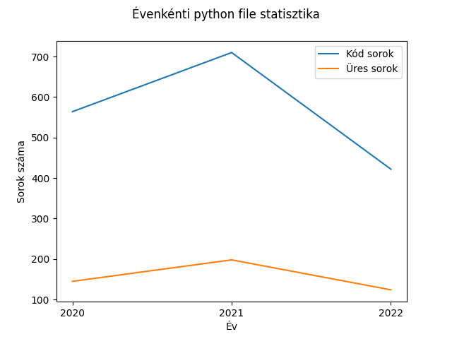
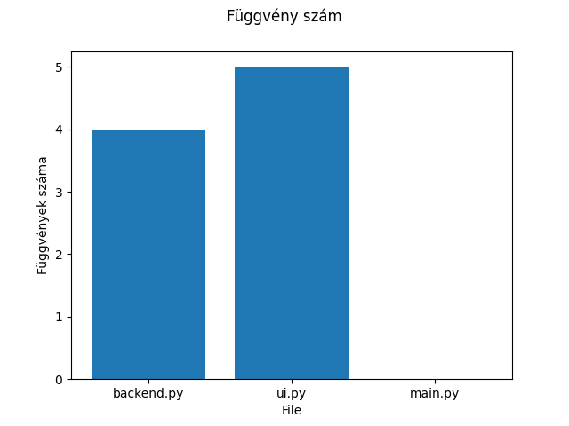

# PótpótZH

A feladat egy olyan program elkészítése, amely a ProgAlap1 mappában található fájlokról készít egy kimutatást.

A mappában `évszám_hónap_nap_cím` elnevezésű almappák vannak, melyek különböző típusú fájlokat tartalmaznak.

## 1. feladat

Ábrázolja, hogy az elmúlt 3 évben (2020, 2021, 2022), a `.py` fájlok évenként hány üres-, illetve kód-sort tartalmaznak. Az üres és hasznos sorok száma két külön diagramon jelenjen meg. A diagramot pedig mentse ki egy `line_stats.png` fileba. A függvény fejléce a következő `def chart_for_lines(root: str)`

```python
chart_for_lines('ProgAlap1')
```



## 2. feladat

Készítsen egy függvényt, ami:

- paraméterként kap egy évszámot, hónapot és napot
- kikeresi a megadott dátumhoz tartozó almappát
  - ha nincs ilyen almappa, dob egy kivételt (exceptiont)
- megjelenít egy oszlopdiagramot, amely az almappában lévő `.py` fájlokban található függvények darabszámát ábrázolja
  - tekintse függvénynek a fájl azon sorait, melyek a `def` szóval kezdődnek, esetleg előtte whitespace található a sorban

A függvény fejléce a következő `def function_count(year: str, month: str, day: str, root: str = 'ProgAlap1')`. A grafikont pedig mentse ki `<év>_<hónap>_<nap>_stats.png` néven.

```python
function_count('2022', '11', '08')
```



## 3. feladat

A 2. feladatban elkészített függvényt egy ciklusban hívja meg, minden hívás előtt bekérve a dátumot a felhasználótól. Feltételezheti, hogy a dátum jól kerül megadásra (4.hó `04` ként van megadva). Ha a függvény kivételt dob, írjon ki hibaüzenetet, és folytassa a ciklust. Ha a felhasználó az `exit` szöveget írja be, álljon le a program.

```python
> python main.py
Mit nyissak meg? 2022_11_08
Sikeres feldolgozás
Mit nyissak meg? 2023_06_13
Valami hiba volt No such file found
Mit nyissak meg? exit
```
